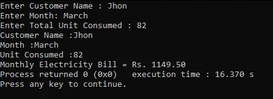

<h1 align="center">Electricity Bill Calculator</h1>
<div align="center">
  <a href="https://github.com/DmetroSK/Electricity-Bill-Calculator-C/stargazers"></a>
<a href="https://github.com/DmetroSK/Electricity-Bill-Calculator-C/network/members"></a>
<a href="https://github.com/DmetroSK/Electricity-Bill-Calculator-C/pulls"></a>
<a href="https://github.com/DmetroSK/Electricity-Bill-Calculator-C/issues"></a>
<a href="https://github.com/DmetroSK/Electricity-Bill-Calculator-C/graphs/contributors"></a>
<a href="https://github.com/DmetroSK/Electricity-Bill-Calculator-C/blob/main/LICENSE"></a>
</div>
<br/>

<details open="open">
  <summary>Table of Contents</summary>
  <ol>
    <li><a href="#about-the-project">About The Project</a></li>
    <li><a href="#built-with">Built With</a></li>
    <li><a href="#interface">Interface</a></li>
    <li><a href="#contributing">Contributing</a></li>
    <li><a href="#license">License</a></li>
    <li><a href="#support">Support</a></li>
  </ol>

</details>

## About The Project

Simple Electricity Bill Calculator Project Using C. You can enter your name , month and units to calculate your electricity bill.

## Built With

```sh
C
```

## Interface



## Contributing

Contributions are what make the open source community such an amazing place to be learn, inspire, and create. Any contributions you make are **greatly appreciated**.

1. Fork the Project
2. Create your Feature Branch (`git checkout -b feature/AmazingFeature`)
3. Commit your Changes (`git commit -m 'Add some AmazingFeature'`)
4. Push to the Branch (`git push origin feature/AmazingFeature`)
5. Open a Pull Request

## Support

Give a ⭐️ if this project helped you!
