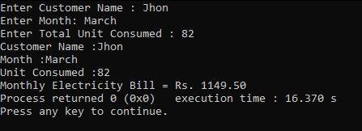

<h1 align="center">Electricity Bill Calculator</h1>
<p align="center"><i>Simple Calculator Project Using C.</i></p>

<br>

## Language

<br>

```sh
C
```

## Introduction

<br>
You can enter your name , month and units to calculate your electricity bill.
<br>




<br>

## Contributing

<br>

Contributions are what make the open source community such an amazing place to be learn, inspire, and create. Any contributions you make are **greatly appreciated**.

1. Fork the Project
2. Create your Feature Branch (`git checkout -b feature/AmazingFeature`)
3. Commit your Changes (`git commit -m 'Add some AmazingFeature'`)
4. Push to the Branch (`git push origin feature/AmazingFeature`)
5. Open a Pull Request

<br>

<!-- CONTACT -->
## Contact

<br>

Email - info@pramuditha-malhara.com

Project Link - [https://github.com/DmetroSK/Electricity-Bill-Calculator-C](https://github.com/DmetroSK/Electricity-Bill-Calculator-C)

<br>

## Support

<br>

Give a ⭐️ if this project helped you!


